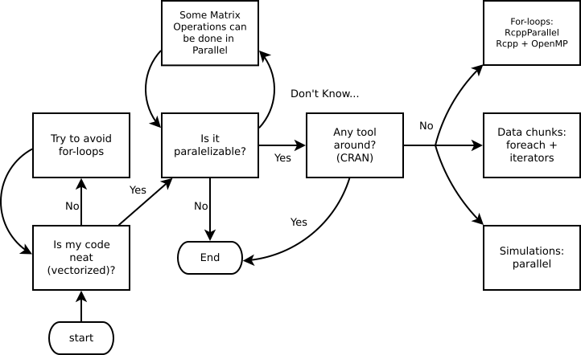
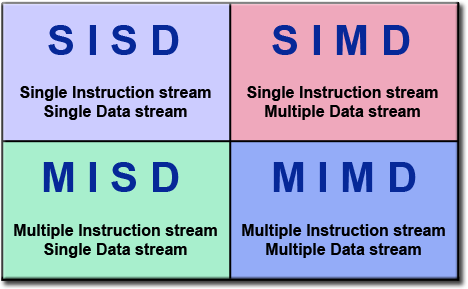
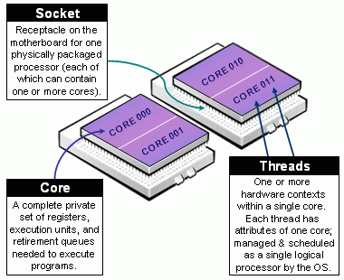

```{r setup, include=FALSE}
knitr::opts_chunk$set(echo = TRUE)
```

## Acerca de

*   Iquiqueño

*   Papá de 2, esposo de 1

*   Quería ser músico, estudié comercial, salté a economía, y ahora estoy
    en bioestadística...
    
*   Programando en R desde el +-2008

*   Ahora, estudiante de doctorado en bioestadística en USC

## Quienes me financian

Computation for the work described in this paper was supported by the University
of Southern California’s Center for High-Performance Computing (hpc.usc.edu).

USC Integrative Methods of Analysis for Genomic Epidemiology (IMAGE)


## Ser o no Ser



## Computación en paralelo

Taxonomía de Flynn



## (cont.)

Grafico de computacion en paralelo

## CPU/Core/Threads

Una consideracion importante es saber distinguir de las partes de tu CPU



## cont.


```{r}
library(parallel)
detectCores()
```


## Que problemas se pueden paralelizar?

Desde el punto de vista de SIMD (Instrucción Única, Múltiples Datos)

*   Simulaciones de Monte Carlo

*   Metodos estadisticos, ej **Bootstrap** (resampleo), **cross-validation**
    (validación cruzada), MCMC, etc.

*   Procesamiento de Datos e.j. 

*   Algunas operaciones matriciales,  (!?)
