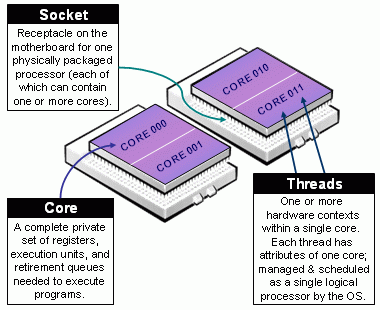

```{r setup, include=FALSE}
knitr::opts_chunk$set(echo = TRUE)
```

## Ser o no Ser


## Computacion en paralelo

Taxonomía de Flynn


## (cont.)

Grafico de computacion en paralelo

## CPU/Core/Threads

Una consideracion importante es saber distinguir de las partes de tu CPU



## cont.


```{r}
library(parallel)
detectCores()
```


## Que problemas se pueden paralelizar?

Desde el punto de vista de SIMD (Instrucción Única, Múltiples Datos)

*   Simulaciones de Monte Carlo

*   Metodos estadisticos, ej **Bootstrap** (resampleo), **cross-validation**
    (validación cruzada), MCMC, etc.

*   Procesamiento de Datos e.j. 

*   Algunas operaciones matriciales,  (!?)
