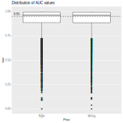

## Problema

*   Para mi tesis doctoral estoy desarrollando un modelo de evolución de funciones
    geneticas (por ejemplo, regulamiento de crecimiento celular)
    
*   La idea es que, utilizando la estructura evolutiva de los genes (aka árbol de la
    vida) podemos inferir funciones que aun no han sido descubiertas
    
---    

```{r arbol, cache=TRUE, message=FALSE, fig.align='center'}
library(aphylo)
set.seed(1344)
tree <- rdrop_annotations(sim_annotated_tree(30, P=2), pcent=.4)
plot(tree, main="Arbol filogenético anotado (simulado)")
```
    
## Descripción del modelo

*   El modelo consiste en el cálculo de la probabilidad de observar un árbol 
    filogenético con un set de anotaciones en particular.
    
*   Utilizo lo que se conoce como el algoritmo de *tree peeling* (post order)...
    lo importante es que dicho algoritmo permite calcular la probabilidad de una
    manera rápida.
    
*   El problema: (1) La solución cerrada no es feasible, (2) El estimador de
    Máxima verosimilitud "no se porta bien"
    
*   La solución: Estimación de parámetros utilizando cadenas de monte carlo (MCMC).

## HPC

*   El algoritmo de cálculo de la función de verosimilitud está escrito con Rcpp
    ([aphylo](https://github.com/USCBiostats/aphylo))

*   El algoritmo de MCMC utiliza el paquete parallel para estimar multiples cadenas
    de forma paralela (hago esto para verificar convergencia) ([amcmc](https://github.com/USCBiostats/amcmc))
    
*   Estudio de simulación: Utilizando la base de datos [PANTHER DB](http://pantherdb.org/)
    (que consiste en cerca de 13.000 arboles), simular el modelo evolutivo en cada
    uno de ellos, estimar el modelo y posteriormente calcular la precisión de la
    las predicciones
    
*   La última parte fue implementada con el [Cluster Computacional de USC](https://hpcc.usc.edu),
    en concreto, utilizando 300 procesadores distribuidos en al rededor de 50
    nodos (PCs). (todo implementado con un 3er paquete desarrollado para esto
    [sluRm](https://github.com/USCBiostats/sluRm))
    
## Resultados

```{r auc, echo=FALSE,fig.align='center'}

```


## {style="text-align:center!important;"}

```{r thanks, out.width="300px", fig.align='center', echo=FALSE}

```

### ¡Gracias!

<p style="text-align:center!important;">
`r icon::fa("github")`  [gvegayon](https://github.com/gvegayon/) <br>
`r icon::fa("twitter")`  [\@gvegayon](https://twitter.com/gvegayon) <br>
`r icon::fa("home")`  [ggvy.cl](https://ggvy.cl)<br><br>
<text style="color:gray;font-size:80%">Presentation created with `r icon::fa("heart")` and [revealjs](https:cran.r-project.org/package=revealjs)</text>
</p>

## See also

*   [Package parallel](https://stat.ethz.ch/R-manual/R-devel/library/parallel/doc/parallel.pdf) 
*   [Using the iterators package](https://cran.r-project.org/web/packages/iterators/vignettes/iterators.pdf)
*   [Using the foreach package](https://cran.r-project.org/web/packages/foreach/vignettes/foreach.pdf)
*   [32 OpenMP traps for C++ developers](https://software.intel.com/en-us/articles/32-openmp-traps-for-c-developers)
*   [The OpenMP API specification for parallel programming](http://www.openmp.org/)
*   ['openmp' tag in Rcpp gallery](gallery.rcpp.org/tags/openmp/)
*   [OpenMP tutorials and articles](http://www.openmp.org/resources/tutorials-articles/)

For more, checkout the [CRAN Task View on HPC](https://cran.r-project.org/web/views/HighPerformanceComputing.html){target="_blank"}

## Session info

```{r session, echo=FALSE}
sessionInfo()
```
